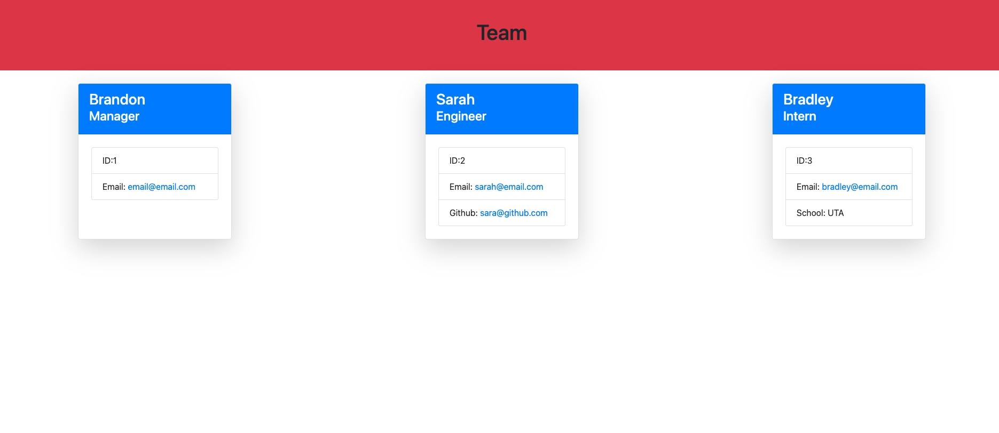
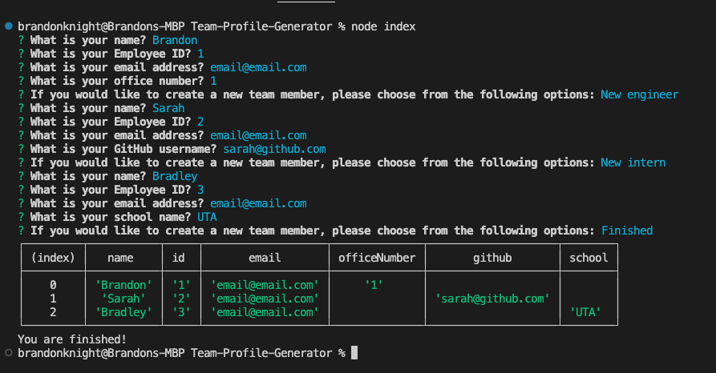

# Team-Profile-Generator

---
## Description:
A Node.js command-line application that takes in information about employees on a software engineering team, then generates an HTML webpage that displays summaries for each person.

---
## Deployment:
To see a demonstration [click here](https://drive.google.com/file/d/1GNF8DgT_4YkdxnLua2_Fj14Sb-JnCryn/view).

In your terminal run:
```  
node index
```
Answer all of the questions and when complete hit enter.
It should look like this:



You should then be able to see your genertated html page by going to the dist folder and opening the index.html in your default broswer.

---
## Credits:
- Thank you to the UTA-Bootcamp team.
- The Coding Collective

---
## License:

[](https://opensource.org/licenses/MIT)
---